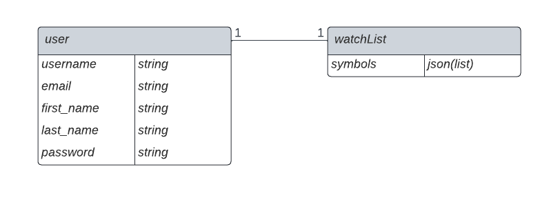
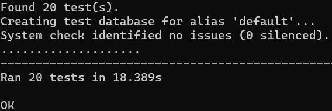

# Getting Started with stock monitor backend.

## Steps to install backend service on your pc.

1. Run `git clone https://github.com/sahiljoster32/stock_monitor_backend.git` into your console to clone the project.
2. Go to inside cloned directory `cd stock_monitor_backend`.
3. Run `pip install -r requirements.txt` to install all requirements.
4. Run `python manage.py makemigrations` to make migrations for all models, like `WatchList` model and `user` model.
5. Run `python manage.py migrate` to migrate all migrations to db's schema.
6. Run `python manage.py runserver` to start the server, so that you can access the APIs locally.

## Model definition to store watchList.

## All tests are passing ✅

## [Demo link for working backend.](https://drive.google.com/file/d/1q0iEllNef7DDe66Knsf7ebhPFLyj-X1N/view?usp=sharing)

Thanks!
